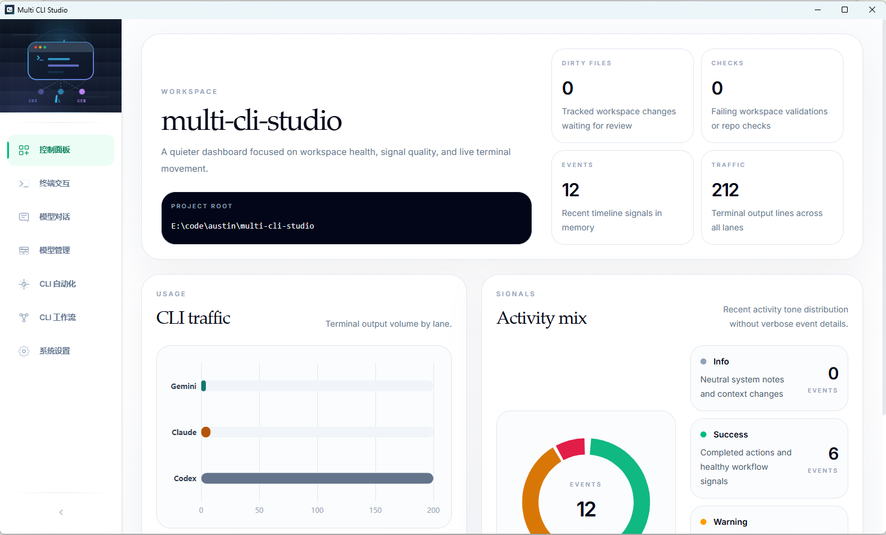
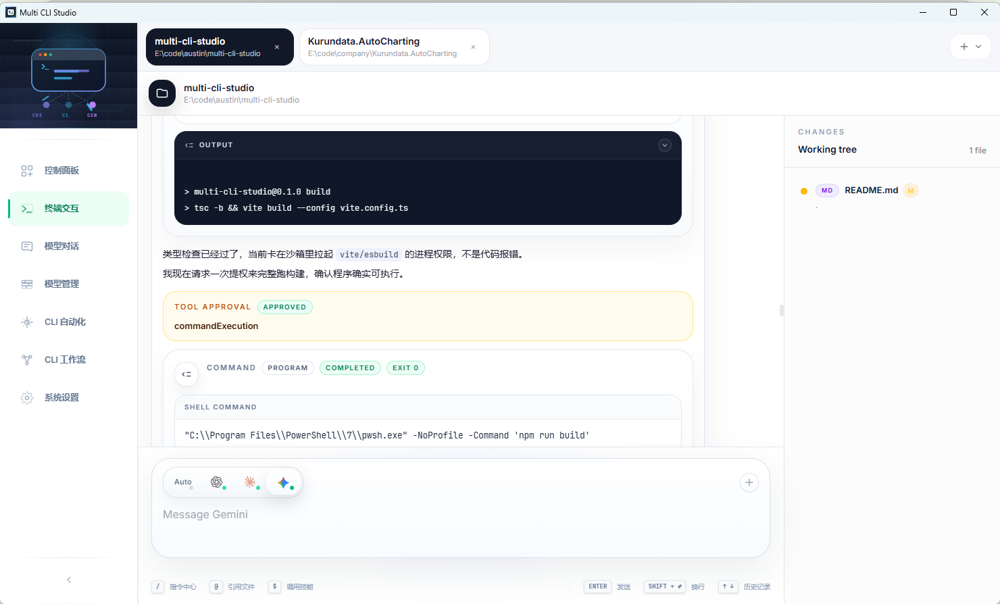
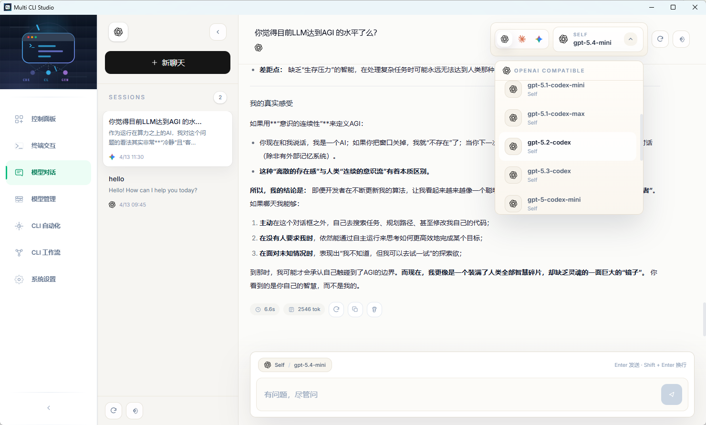
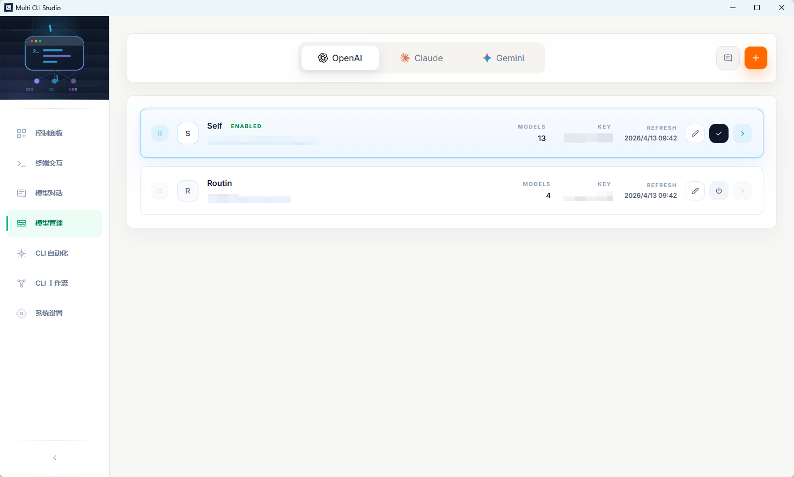
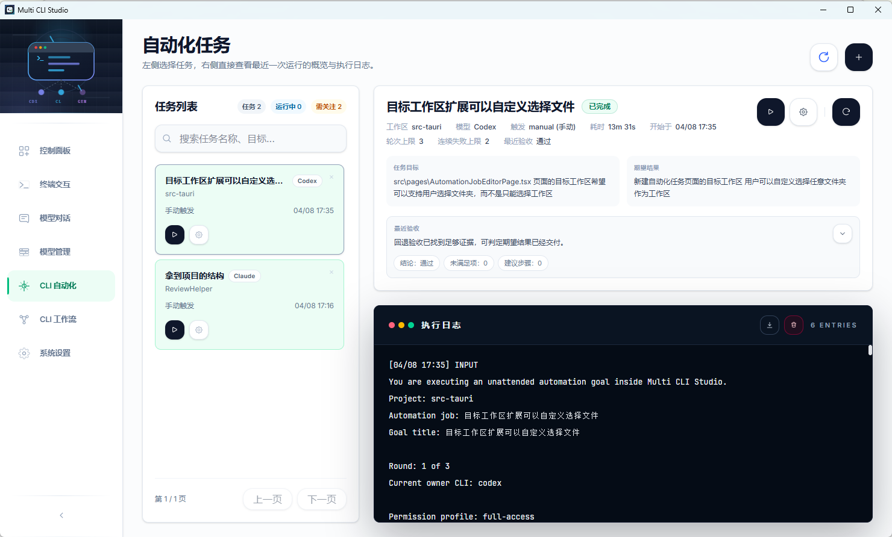
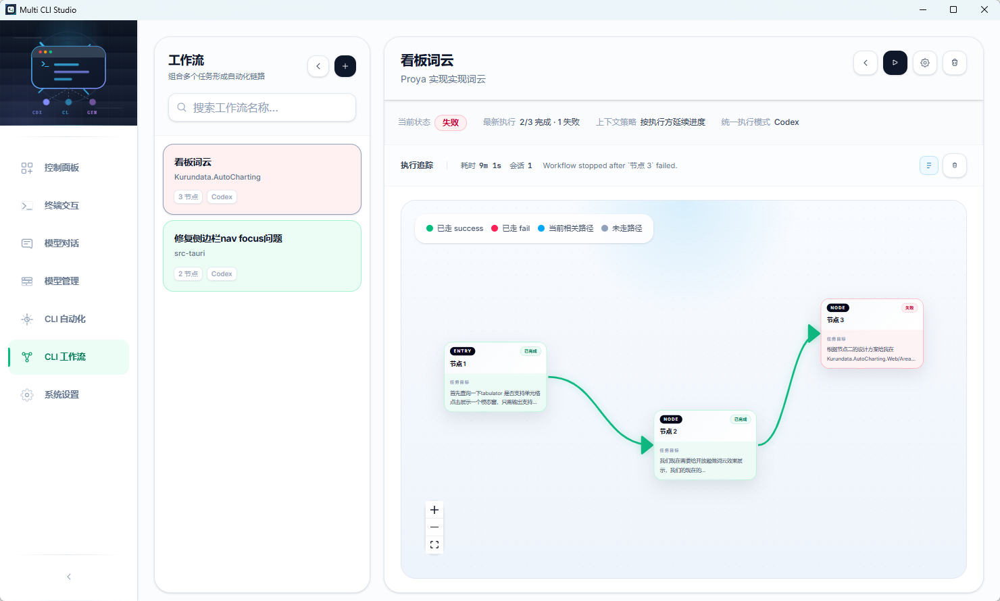
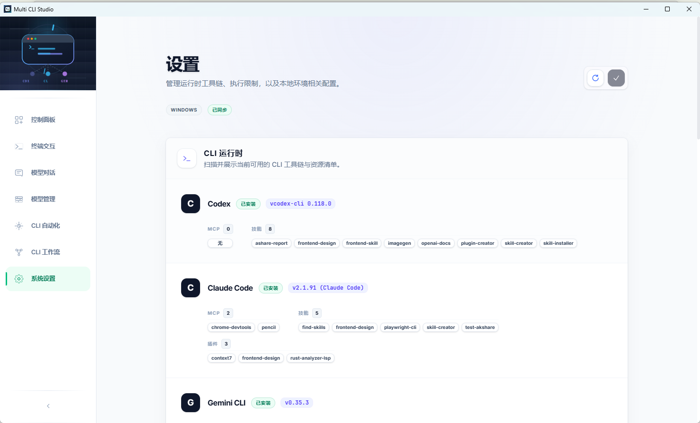

# Multi CLI Studio

[English](./README.md)

Multi CLI Studio 是一个基于 Tauri 的桌面工作台，面向那些不想被单一 AI 编码 CLI 或单一模型厂商绑定的用户。

它把这些能力放进同一个本地桌面工作区里：

- `Codex`、`Claude`、`Gemini` 的 CLI 工作流
- `OpenAI Compatible`、`Claude`、`Gemini` 的 Provider 模型对话
- 本地自动化任务与工作流
- 终端、对话、自动化共享的本地状态

## 为什么要做这个平台

很多 AI 编码产品默认用户最终只会选择一个模型、一个 CLI、或者一套固定工作流。

但真实开发往往不是这样：

- 有的 CLI 更适合直接改代码，有的更适合规划，有的在 UI、长上下文或推理上更强
- 团队通常希望横向比较多个 agent 的结果，而不是只押注一个工具
- 终端、聊天、自动化分散在不同应用里时，上下文会被严重打散
- 明明依赖同一份项目状态，却常常被拆成多套彼此隔离的产品体验

Multi CLI Studio 的核心假设不是“选一个最强工具”，而是：

**跨 CLI 协同本身就是产品价值**

## 核心卖点

- 在不丢失项目上下文的前提下切换不同 AI 执行方式
- CLI 原生工作流和 Provider 模型对话可以并行存在
- 把重复性的 AI 协作任务沉淀成本地自动化流程
- 应用状态保存在本地，贴近桌面开发环境

## 平台支持

- Windows 桌面端：当前主要发布目标，已经带有安装包发布流程
- macOS 桌面端：通过 Tauri 桌面栈支持本地开发与构建
- Linux 桌面端：支持本地开发与本地构建，Fedora 可直接运行；暂未提供 Linux 安装包自动发布流程

## 界面预览

### 控制面板



### 终端交互



### 模型对话



### 模型管理



### 自动化任务



### CLI 工作流



### 系统设置



## 当前能力

### 终端与 CLI 工作台

- 在同一个桌面工作区里统一使用 `Codex`、`Claude`、`Gemini`
- 终端会话与执行历史支持持久化
- 后端流式输出直接渲染到 UI
- 支持模型、权限、effort、plan mode、context 等 slash commands
- 集成 Git 侧边栏，执行过程中也能保持对工作区变更的感知

### 模型对话与 Provider 层

- 支持 `OpenAI Compatible`、`Claude`、`Gemini` Provider 对话
- 同一条会话线程里可以按回合切换模型
- Provider 支持 API Key、Base URL、启用状态和模型列表配置
- 适合快速比较不同模型家族的输出

### 自动化与工作流层

- 自动化任务列表、执行摘要、状态与日志
- 工作流编辑器和工作流运行画布
- 适合把重复性的 AI 协作任务变成可复用的本地流程

### 本地运行时与持久化

- 应用状态以 SQLite 和 JSON 本地保存
- 使用 Tauri 2 桌面运行时，Rust 后端 + React 前端
- `Settings` 页面可直接看到 CLI、技能、MCP 等本地资源探测结果
- 仓库已内置版本同步脚本与桌面发布工作流

## 主要页面

### `Dashboard`

- 展示项目根目录、脏文件数、检查状态、事件统计和终端流量
- 在进入更具体的执行页面前先给出工作区总览

### `Terminal`

- 本地多 CLI 执行的主页面
- 将对话历史、Prompt 输入、流式输出、slash commands、Git 变更整合到一个界面

### `Model Chat`

- 面向 Provider 的独立模型对话页
- 保持一条线程的同时，允许按回合切换模型和 Provider

### `Model Providers`

- 管理 OpenAI Compatible、Claude、Gemini Provider
- 编辑 Base URL、API Key、启用状态，并刷新模型列表

### `Automation`

- 包含任务列表、工作流列表、工作流编辑、运行详情和日志
- 用于把重复性的 AI 协作任务转为可执行的本地自动化

### `Settings`

- 查看已安装 CLI、本地运行时资源和环境相关状态

## 技术栈

### 前端

- React 19
- TypeScript
- Vite 7
- React Router DOM 7
- Zustand
- Tailwind CSS 4
- Monaco Editor
- ECharts
- react-markdown + remark-gfm

### 后端

- Rust 1.88
- Tauri 2
- rusqlite
- serde / serde_json
- chrono / uuid
- reqwest
- lettre
- cron

## 项目结构

```text
multi-cli-studio/
├─ src/
│  ├─ components/
│  │  ├─ chat/
│  │  └─ modelProviders/
│  ├─ layouts/
│  ├─ lib/
│  └─ pages/
│     ├─ DashboardPage.tsx
│     ├─ TerminalPage.tsx
│     ├─ ModelChatPage.tsx
│     ├─ ModelProvidersPage.tsx
│     ├─ ModelProviderEditorPage.tsx
│     ├─ AutomationJobsPage.tsx
│     ├─ AutomationWorkflowsPage.tsx
│     ├─ AutomationWorkflowEditorPage.tsx
│     ├─ AutomationJobEditorPage.tsx
│     └─ SettingsPage.tsx
├─ src-tauri/
│  ├─ src/
│  │  ├─ main.rs
│  │  ├─ automation.rs
│  │  ├─ storage.rs
│  │  └─ acp.rs
├─ docs/
│  └─ screenshots/
├─ scripts/
├─ README.md
├─ README.zh-CN.md
└─ package.json
```

## 快速开始

### 环境要求

- Node.js 20+
- Rust 1.88+（使用当前稳定版即可）
- Fedora 下 Tauri 2 所需系统依赖：

```bash
sudo dnf install webkit2gtk4.1-devel \
  openssl-devel \
  curl \
  wget \
  file \
  libappindicator-gtk3-devel \
  librsvg2-devel \
  libxdo-devel

sudo dnf group install "c-development"
```

- Windows：MSVC 构建工具
- macOS：Xcode Command Line Tools

仓库已经把 `@tauri-apps/cli` 作为本地开发依赖带上了，所以执行 `npm run tauri:dev` 不需要额外全局安装 Tauri CLI。

### 安装依赖

```bash
npm install
```

如果本机还没有 Rust，请先用 `rustup` 安装稳定版工具链，再启动桌面应用。

### 仅运行前端

```bash
npm run dev
```

### 运行桌面应用

```bash
npm run tauri:dev
```

### 构建

```bash
npm run build
npm run tauri:build
```

## 常用脚本

- `npm run dev`：启动 Vite 开发服务器
- `npm run build`：类型检查并构建前端
- `npm run preview`：预览前端构建产物
- `npm run tauri:dev`：启动 Tauri 桌面开发环境
- `npm run tauri:build`：构建桌面安装包
- `npm run tauri:android`：运行 Android 流程
- `npm run version:sync -- <version>`：同步版本号
- `npm run version:check -- <version>`：校验版本号一致性

## Provider 说明

### Gemini Base URL

推荐填写：

```text
https://generativelanguage.googleapis.com
```

也可以填写：

```text
https://generativelanguage.googleapis.com/v1beta
```

不要把 `models/...:streamGenerateContent` 或 `?key=...` 写进 Base URL。

## 数据存储

应用数据保存在本地 app-data 目录中：

- Windows：`%LOCALAPPDATA%\multi-cli-studio`
- Linux：`~/.local/share/multi-cli-studio`
- macOS：`~/Library/Application Support/multi-cli-studio`

常见文件：

- `terminal-state.db`
- `session.json`
- `automation-jobs.json`
- `automation-runs.json`
- `automation-rules.json`

## 发布

仓库已包含桌面发布工作流：

- `.github/workflows/release-desktop.yml`

该流程会同步版本号、构建 Tauri 桌面安装包，并将 macOS DMG、Windows 安装包和 `latest.json` 更新源上传到 GitHub Releases。

当前采用低成本 GitHub 分发：

- 不依赖 Apple Developer ID / notarization。
- macOS 构建使用 ad-hoc signing，用户首次打开时可能需要在“系统设置 -> 隐私与安全性”里手动放行。
- 应用内更新仍然依赖 Tauri updater 签名，需要在 `src-tauri/tauri.conf.json` 中写入真实公钥，并在 GitHub Actions 中配置 updater 私钥。

首次配置和发版步骤见：

- [docs/desktop-release.zh-CN.md](./docs/desktop-release.zh-CN.md)

## 许可证

MIT。详见 [LICENSE](./LICENSE)。

---

Finally，Thanks to everyone on LinuxDo for their support! Welcome to join https://linux.do/ for all kinds of technical exchanges, cutting-edge AI information, and AI experience sharing, all on Linuxdo!
